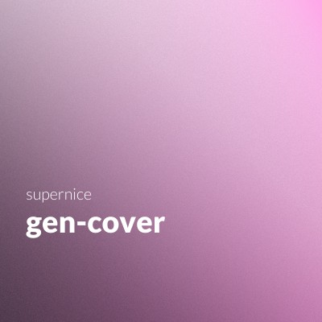

# generate playlist cover images

A TCP server that just generates images on requests

The response in split into two, size and image. The first 4 bytes are the filesize.



## Development

Configure the local server by copying [.template.env](.template.env) to a new file (`.env`) and add your overrides.

```sh
# to run locally
go run ./
# or use `modd`
modd
```

```sh
# to run tests
go test ./..
# or
make test
```

To verify that you get the desirec output, use `nc` to connect to the TCP server

and `dd` to strip the first `4` bytes to the file.

```sh
echo -n "hello" | nc 0.0.0.0 8091 | dd skip=4 bs=1 of=file.jpg status=none
```
